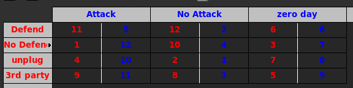

# HML Scripter

This program is designed to automatically generate Hypergame Modelling Language (HML)
files given a list of games defined by preference vectors. The output of this program
is designed to be used as the input for the Hypergame Analysis Tool (HYPANT) (see 
https://users.monash.edu/~lbrumley/hyper.html). 

## How To Run

Run the python file, ```python3 hml_scripter.py``` with no arguments. The script will
explain step-by-step what is required. At certain points, it will ask the user to provide
Gambit files (.gbt or .nfg file extensions). It's easiest to have these files in the 
same directory as where the hml_scripter.py is located. 

## Gambit File Example

The script will ask for Gambit files (https://gambitproject.readthedocs.io/en/latest/)
to read in the preference vectors for each game within the hypergame structure. An
understanding of hypergames, hypergame structures, and preference vectors is vital to
creating Gambit files in the correct way.

Here is an example of a Gambit file with correct values:



Player 1's preference vector values are in <span style="color:red">red</span> while
player 2's values are in <span style="color:blue">blue</span>. There are a total of
12 different outcomes. Player 1 has four strategies and player 2 has three strategies,
thus 3 * 4 = 12 total outcomes. In each game, each player has a preference vector where
there most preferred outcome is the highest number (or lowest number, the script will
ask you which one). In this example, 12 is the most preferred outcome and 1 is the least
preferred outcome. So for player 2, designated at the "attacker", 
the most preferred outcome is where player 1 does not defend
and player 2 attacks, so that cell value is filled with a value of 12. (the values in
these cells were randomly generate so please don't try to reason through these preference
vectors in this example). 

Gambit generally uses utility values instead of preference vectors. Converting 
utility values to preference vectors is done by ordering each payoff based
on the utility value payoff and assigning the highest payoff to be the highest preference
vector. Analysis of hypergame with preference vectors does not care about absolute
numbers of payoff values, but only relative ordering of preferences, which is why
this method works. 


